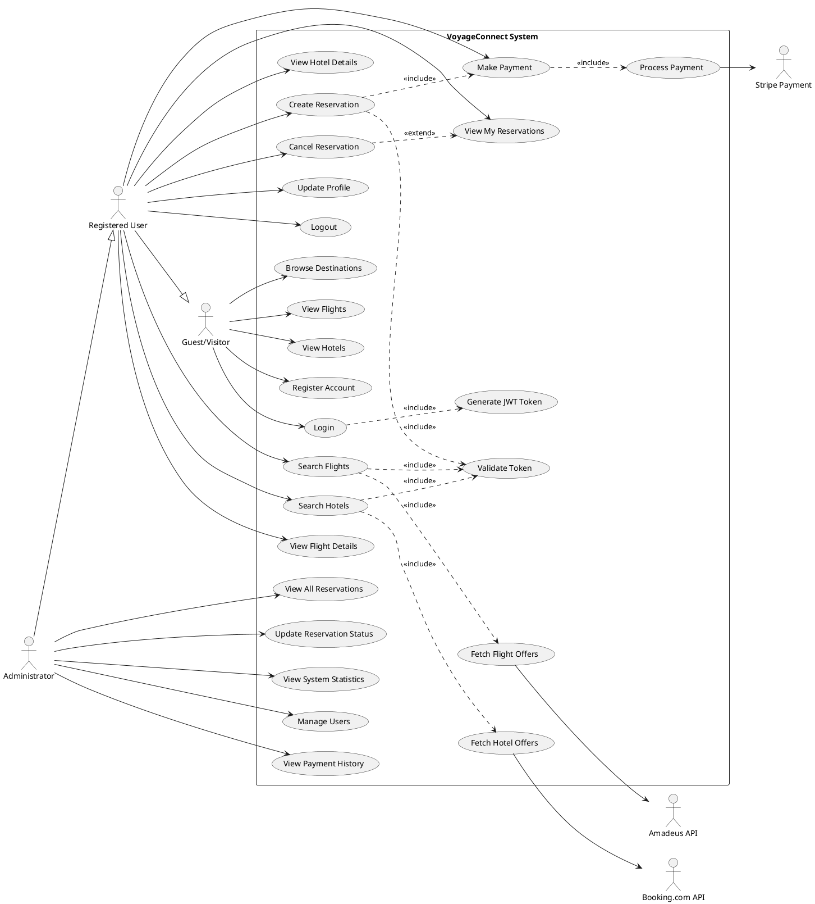
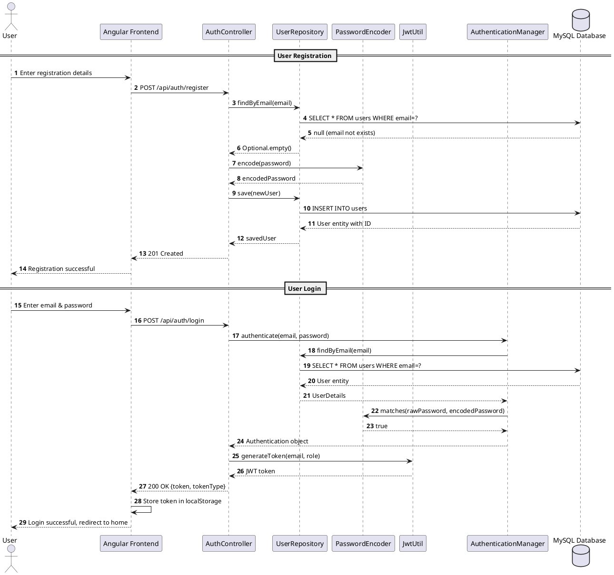
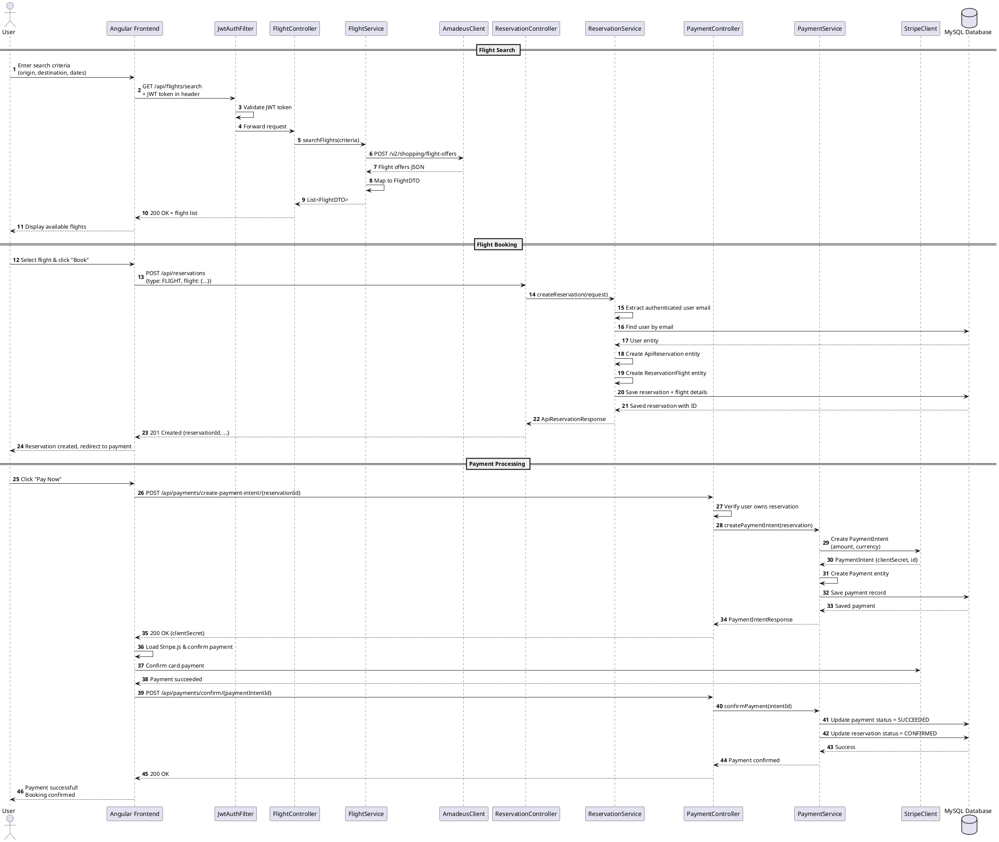
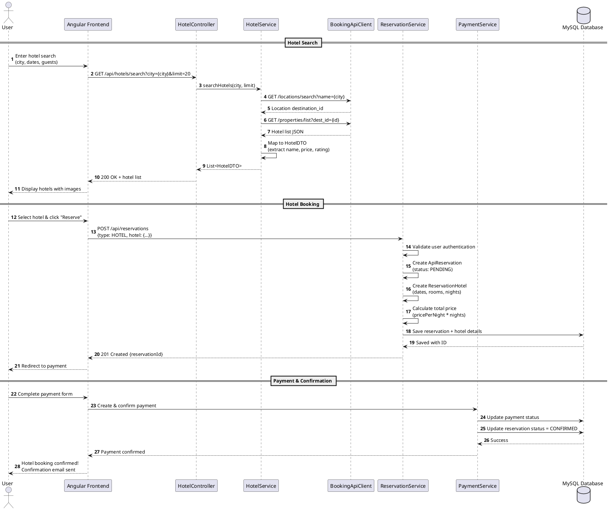
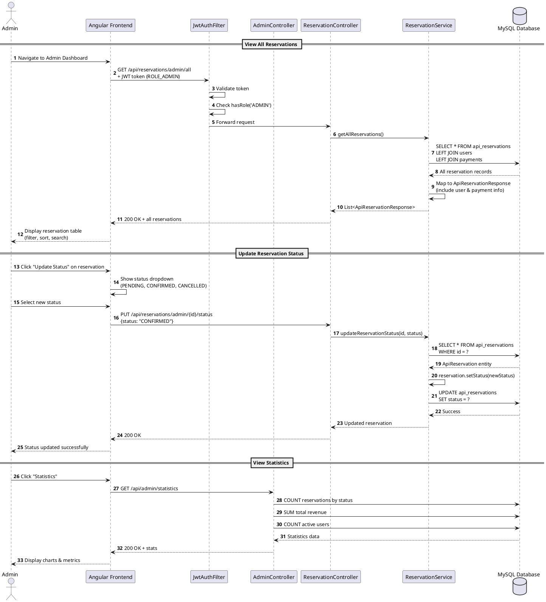
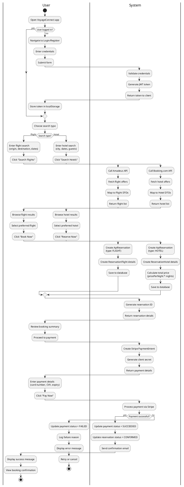
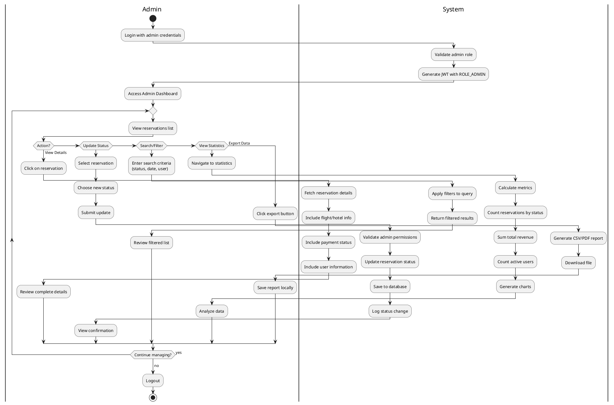

# VoyageConnect - UML Diagrams & System Design Report

## Project Overview

**VoyageConnect** is a comprehensive travel booking platform that allows users to search and book flights and hotels through integration with external APIs (Amadeus for flights, Booking.com for hotels). The system includes user authentication, payment processing via Stripe, and an admin dashboard for managing all reservations.

### Key Technologies
- **Backend**: Spring Boot 3.x, Spring Security, Spring Data JPA, MySQL
- **Frontend**: Angular 16+ with Material Design
- **External APIs**: Amadeus API, Booking.com API (RapidAPI), Stripe Payment Gateway
- **Authentication**: JWT (JSON Web Tokens)

---

## 1. Use Case Diagram

### Description
The use case diagram illustrates the main functionalities of the VoyageConnect system and the actors who interact with it. The system has three main actors:
- **Guest/Visitor**: Unregistered users who can browse destinations
- **Registered User**: Authenticated users who can search and book travel services
- **Administrator**: System admins who manage the platform

### PlantUML Code



### Use Case Descriptions

| Use Case ID | Name | Actor | Description |
|-------------|------|-------|-------------|
| UC1 | Browse Destinations | Guest | Browse available travel destinations |
| UC2 | View Flights | Guest | View flight listings without booking |
| UC3 | View Hotels | Guest | View hotel listings without booking |
| UC4 | Register Account | Guest | Create a new user account |
| UC5 | Login | Guest/User | Authenticate into the system |
| UC6 | Search Flights | User | Search for available flights using filters |
| UC7 | Search Hotels | User | Search for available hotels using filters |
| UC10 | Create Reservation | User | Book a flight, hotel, or package |
| UC11 | Make Payment | User | Process payment for reservation |
| UC12 | View My Reservations | User | View personal booking history |
| UC13 | Cancel Reservation | User | Cancel an existing reservation |
| UC16 | View All Reservations | Admin | View all system reservations |
| UC17 | Update Reservation Status | Admin | Modify reservation status |

---

## 2. Class Diagram

### Description
The class diagram shows the structure of the VoyageConnect system, including all domain entities, their attributes, relationships, and cardinalities. The system follows a layered architecture with clear separation between entities, services, controllers, and repositories.

### PlantUML Code



```plantuml
@startuml VoyageConnect_ClassDiagram
skinparam classAttributeIconSize 0
skinparam linetype ortho

' ============================================
' DOMAIN ENTITIES
' ============================================

class User {
  - id: Long
  - fullName: String
  - email: String
  - password: String
  - role: Role
  --
  + getReservations(): List<ApiReservation>
}

enum Role {
  USER
  ADMIN
}

class Destination {
  - id: Long
  - country: String
  - city: String
  - description: String
  --
  + getFlights(): List<Flight>
  + getHotels(): List<Hotel>
}

class Flight {
  - id: Long
  - departure: LocalDateTime
  - arrival: LocalDateTime
  - price: BigDecimal
  - availableSeats: Integer
  - airline: String
  - flightNumber: String
  - imageUrl: String
  --
  + getDestination(): Destination
}

class Hotel {
  - id: Long
  - name: String
  - pricePerNight: BigDecimal
  - availableRooms: Integer
  - address: String
  - rating: Integer
  - imageUrl: String
  - description: String
  - provider: String
  --
  + getDestination(): Destination
}

class ApiReservation {
  - id: Long
  - type: ReservationType
  - status: ReservationStatus
  - totalPrice: BigDecimal
  - createdAt: LocalDateTime
  --
  + getUser(): User
  + getFlightDetails(): ReservationFlight
  + getHotelDetails(): ReservationHotel
}

enum ReservationType {
  FLIGHT
  HOTEL
  PACKAGE
}

enum ReservationStatus {
  PENDING
  CONFIRMED
  CANCELLED
  COMPLETED
}

class ReservationFlight {
  - id: Long
  - flightNumber: String
  - airline: String
  - departureDate: LocalDateTime
  - arrivalDate: LocalDateTime
  - origin: String
  - destination: String
  - passengers: Integer
  - price: BigDecimal
  --
  + getReservation(): ApiReservation
}

class ReservationHotel {
  - id: Long
  - hotelName: String
  - checkInDate: LocalDate
  - checkOutDate: LocalDate
  - city: String
  - roomCount: Integer
  - nights: Integer
  - pricePerNight: BigDecimal
  - totalPrice: BigDecimal
  --
  + getReservation(): ApiReservation
}

class Payment {
  - id: Long
  - amount: BigDecimal
  - method: PaymentMethod
  - status: PaymentStatus
  - stripePaymentIntentId: String
  - stripeClientSecret: String
  - failureReason: String
  - createdAt: LocalDateTime
  - updatedAt: LocalDateTime
  --
  + getReservation(): ApiReservation
}

enum PaymentMethod {
  CREDIT_CARD
  DEBIT_CARD
  STRIPE
}

enum PaymentStatus {
  PENDING
  PROCESSING
  SUCCEEDED
  FAILED
  CANCELLED
}

' ============================================
' CONTROLLERS (REST API)
' ============================================

class AuthController {
  - authenticationManager: AuthenticationManager
  - jwtUtil: JwtUtil
  - userRepository: UserRepository
  - passwordEncoder: PasswordEncoder
  --
  + login(request: AuthRequest): AuthResponse
  + register(request: RegisterRequest): ResponseEntity
}

class ApiReservationController {
  - reservationService: ApiReservationService
  --
  + createReservation(request: CreateApiReservationRequest): ResponseEntity
  + getUserReservations(): List<ApiReservationResponse>
  + getReservation(id: Long): ApiReservationResponse
  + getAllReservations(): List<ApiReservationResponse>
  + updateReservationStatus(id: Long, status: String): ResponseEntity
}

class PaymentController {
  - paymentService: PaymentService
  - reservationRepository: ApiReservationRepository
  --
  + createPaymentIntent(reservationId: Long): PaymentIntentResponse
  + confirmPayment(paymentIntentId: String): ResponseEntity
  + getPaymentStatus(reservationId: Long): ResponseEntity
}

class FlightController {
  - flightService: FlightService
  --
  + searchFlights(origin: String, destination: String, ...): List<FlightDTO>
  + getFlightDetails(id: Long): FlightDTO
}

class HotelController {
  - hotelService: HotelService
  --
  + searchHotels(city: String, checkIn: String, ...): List<HotelDTO>
  + getHotelDetails(id: Long): HotelDTO
}

class DestinationController {
  - destinationService: DestinationService
  --
  + getAllDestinations(): List<DestinationDTO>
  + searchDestinations(query: String): List<DestinationDTO>
  + getDestination(id: Long): DestinationDTO
}

class AdminController {
  - adminService: AdminService
  --
  + getStatistics(): StatisticsDTO
  + getAllUsers(): List<UserDTO>
  + deleteUser(id: Long): ResponseEntity
}

' ============================================
' SERVICES (BUSINESS LOGIC)
' ============================================

class ApiReservationService {
  - reservationRepository: ApiReservationRepository
  - userRepository: UserRepository
  - paymentService: PaymentService
  --
  + createReservation(request: CreateApiReservationRequest): ApiReservationResponse
  + getUserReservations(): List<ApiReservationResponse>
  + getReservation(id: Long): ApiReservationResponse
  + updateReservationStatus(id: Long, status: ReservationStatus): ApiReservation
}

class PaymentService {
  - paymentRepository: PaymentRepository
  - stripeClient: Stripe
  --
  + createPaymentIntent(reservation: ApiReservation): PaymentIntentResponse
  + confirmPayment(paymentIntentId: String): Payment
  + getPaymentByReservationId(reservationId: Long): Payment
}

class FlightService {
  - flightRepository: FlightRepository
  - amadeusClient: AmadeusClient
  --
  + searchFlights(criteria: FlightSearchCriteria): List<Flight>
  + getFlightOffers(origin: String, destination: String): List<FlightDTO>
}

class HotelService {
  - hotelRepository: HotelRepository
  - bookingApiClient: BookingApiClient
  --
  + searchHotels(criteria: HotelSearchCriteria): List<Hotel>
  + getHotelOffers(city: String, dates: String[]): List<HotelDTO>
}

class DestinationService {
  - destinationRepository: DestinationRepository
  - imageService: ImageService
  --
  + search(query: String): List<Destination>
  + getAll(): List<Destination>
  + getById(id: Long): Destination
}

class CustomUserDetailsService {
  - userRepository: UserRepository
  --
  + loadUserByUsername(email: String): UserDetails
}

' ============================================
' SECURITY COMPONENTS
' ============================================

class JwtUtil {
  - secret: String
  - expirationMs: Long
  --
  + generateToken(username: String, role: String): String
  + extractUsername(token: String): String
  + validateToken(token: String): Boolean
}

class JwtAuthenticationFilter {
  - jwtUtil: JwtUtil
  - userDetailsService: CustomUserDetailsService
  --
  + doFilterInternal(request, response, filterChain): void
}

class SecurityConfig {
  --
  + securityFilterChain(http: HttpSecurity): SecurityFilterChain
  + authenticationManager(): AuthenticationManager
  + passwordEncoder(): PasswordEncoder
}

' ============================================
' EXTERNAL API CLIENTS
' ============================================

class AmadeusClient {
  - apiKey: String
  - apiSecret: String
  - restTemplate: RestTemplate
  --
  + authenticate(): String
  + searchFlights(params: Map): FlightOffersResponse
  + searchDestinations(keyword: String): LocationResponse
}

class BookingApiClient {
  - apiKey: String
  - apiHost: String
  - restTemplate: RestTemplate
  --
  + searchHotels(params: Map): HotelSearchResponse
  + getHotelDetails(hotelId: String): HotelDetailsResponse
}

class StripeClient {
  - secretKey: String
  --
  + createPaymentIntent(amount: BigDecimal, currency: String): PaymentIntent
  + confirmPaymentIntent(paymentIntentId: String): PaymentIntent
}

' ============================================
' REPOSITORIES (DATA ACCESS)
' ============================================

interface UserRepository {
  + findByEmail(email: String): Optional<User>
  + existsByEmail(email: String): Boolean
}

interface ApiReservationRepository {
  + findByUserId(userId: Long): List<ApiReservation>
  + findByStatus(status: ReservationStatus): List<ApiReservation>
}

interface PaymentRepository {
  + findByReservationId(reservationId: Long): Optional<Payment>
  + findByStripePaymentIntentId(intentId: String): Optional<Payment>
}

interface FlightRepository {
  + findByDestinationId(destId: Long): List<Flight>
  + findByAirline(airline: String): List<Flight>
}

interface HotelRepository {
  + findByDestinationId(destId: Long): List<Hotel>
  + findByRatingGreaterThan(rating: Integer): List<Hotel>
}

interface DestinationRepository {
  + findByCityContainingIgnoreCase(city: String): List<Destination>
  + findByCountry(country: String): List<Destination>
}

' ============================================
' RELATIONSHIPS
' ============================================

' Entity Relationships
User "1" --> "0..*" ApiReservation : has >
User --> Role : has >

Destination "1" --> "0..*" Flight : offers >
Destination "1" --> "0..*" Hotel : offers >

ApiReservation --> ReservationType : has >
ApiReservation --> ReservationStatus : has >
ApiReservation "1" --> "0..1" ReservationFlight : contains >
ApiReservation "1" --> "0..1" ReservationHotel : contains >
ApiReservation "1" <-- "0..1" Payment : pays for >

Payment --> PaymentMethod : uses >
Payment --> PaymentStatus : has >

' Controller-Service Dependencies
AuthController --> CustomUserDetailsService
AuthController --> JwtUtil
ApiReservationController --> ApiReservationService
PaymentController --> PaymentService
FlightController --> FlightService
HotelController --> HotelService
DestinationController --> DestinationService
AdminController --> ApiReservationService

' Service-Repository Dependencies
ApiReservationService --> ApiReservationRepository
ApiReservationService --> UserRepository
PaymentService --> PaymentRepository
FlightService --> FlightRepository
HotelService --> HotelRepository
DestinationService --> DestinationRepository
CustomUserDetailsService --> UserRepository

' Service-External API Dependencies
FlightService --> AmadeusClient
HotelService --> BookingApiClient
PaymentService --> StripeClient

' Security Dependencies
JwtAuthenticationFilter --> JwtUtil
JwtAuthenticationFilter --> CustomUserDetailsService
SecurityConfig --> JwtAuthenticationFilter

@enduml
```

### Key Design Patterns
- **Repository Pattern**: Data access abstraction through Spring Data JPA
- **Service Layer Pattern**: Business logic separation
- **DTO Pattern**: Data transfer between layers
- **Factory Pattern**: Object creation for reservations
- **Strategy Pattern**: Different payment methods
- **Singleton Pattern**: Spring Bean management

---

## 3. Sequence Diagrams

### 3.1 User Registration & Login Sequence



### 3.2 Flight Search & Booking Sequence



### 3.3 Hotel Search & Booking Sequence



### 3.4 Admin Reservation Management Sequence



---

## 4. Activity Diagrams

### 4.1 Complete Booking Process Activity Diagram



### 4.2 Admin Reservation Management Activity Diagram



### 4.3 Payment Processing Activity Diagram

```plantuml
@startuml Payment_Processing_Activity
|User|
start
:Complete reservation form;
:Click "Proceed to Payment";

|Frontend|
:Validate reservation data;
:Send create reservation request;

|Backend|
:Create ApiReservation entity;
:Set status = PENDING;
:Save to database;
:Return reservation ID;

|Frontend|
:Navigate to payment page;
:Display order summary;

|User|
:Review booking details;
:Click "Pay Now";

|Frontend|
:Request payment intent;

|Backend|
:Validate user owns reservation;
:Calculate payment amount;

|Payment Service|
:Create Stripe PaymentIntent;
:Set amount and currency;

|Stripe API|
:Generate client secret;
:Return PaymentIntent object;

|Payment Service|
:Create Payment entity;
:Set status = PENDING;
:Store Stripe IDs;
:Save to database;
:Return client secret;

|Frontend|
:Load Stripe.js library;
:Initialize Stripe Elements;
:Display payment form;

|User|
:Enter card details\n(number, CVV, expiry);
:Click "Submit Payment";

|Frontend|
:Validate card format;
:Call stripe.confirmCardPayment();

|Stripe API|
:Process payment;
:Verify card;
:Check funds;

if (Payment authorized?) then (yes)
  |Stripe API|
  :Charge card;
  :Return success status;
  
  |Frontend|
  :Send payment confirmation;
  
  |Backend|
  :Update payment status = SUCCEEDED;
  :Update reservation status = CONFIRMED;
  :Commit transaction;
  :Trigger confirmation email;
  
  |Frontend|
  :Display success message;
  :Show booking confirmation;
  
  |User|
  :Receive confirmation email;
  :View booking in "My Reservations";
  stop
  
else (no)
  |Stripe API|
  :Return error details\n(insufficient funds, invalid card, etc.);
  
  |Frontend|
  :Send payment failure;
  
  |Backend|
  :Update payment status = FAILED;
  :Store failure reason;
  :Keep reservation status = PENDING;
  :Save to database;
  
  |Frontend|
  :Display error message;
  :Show retry option;
  
  if (User wants to retry?) then (yes)
    |User|
    :Update payment method;
    :Click "Retry Payment";
    
    |Frontend|
    backward:Request new payment intent;
    
  else (no)
    |User|
    :Cancel reservation;
    
    |Backend|
    :Update reservation status = CANCELLED;
    :Release inventory;
    
    stop
  endif
endif

@enduml
```

### 4.4 User Authentication Flow Activity Diagram

```plantuml
@startuml Authentication_Activity
|User|
start
:Access protected page;

|Frontend|
if (JWT token exists?) then (yes)
  :Extract token from localStorage;
  :Add token to request header;
  
  |Backend (JwtAuthFilter)|
  :Extract token from header;
  :Validate token signature;
  
  if (Token valid?) then (yes)
    :Extract username from token;
    :Load user from database;
    :Set authentication context;
    :Allow request to proceed;
    
    |Controller|
    :Process business logic;
    :Return response;
    
    |Frontend|
    :Display protected content;
    stop
    
  else (no - expired/invalid)
    :Return 401 Unauthorized;
    
    |Frontend|
    :Clear invalid token;
    :Redirect to login page;
  endif
  
else (no)
  :Redirect to login page;
endif

|User|
:Enter email and password;
:Click "Login";

|Frontend|
:Validate form fields;
:Send POST /api/auth/login;

|Backend (AuthController)|
:Receive login request;

|AuthenticationManager|
:Load user by email;
:Compare passwords;

if (Credentials valid?) then (yes)
  |JwtUtil|
  :Generate JWT token;
  :Set expiration (24 hours);
  :Sign with secret key;
  
  |AuthController|
  :Return token in response;
  
  |Frontend|
  :Store token in localStorage;
  :Set up HTTP interceptor;
  :Redirect to home page;
  
  |User|
  :Access protected features;
  stop
  
else (no)
  |AuthController|
  :Return 401 Unauthorized;
  
  |Frontend|
  :Display error message\n"Invalid credentials";
  
  |User|
  if (Retry?) then (yes)
    :Enter new credentials;
    backward:Submit login form;
  else (no)
    :Exit application;
    stop
  endif
endif

@enduml
```

---

## 5. System Architecture Overview

### 5.1 Architecture Layers

```
┌─────────────────────────────────────────────────────────────┐
│                    PRESENTATION LAYER                        │
│  Angular 16+ (Frontend) - Material Design Components        │
│  - Home Component      - Flight Search     - Hotel Search   │
│  - Booking Component   - Payment Component - Admin Dashboard│
└─────────────────────────────────────────────────────────────┘
                            ↕ HTTP/REST + JWT
┌─────────────────────────────────────────────────────────────┐
│                    CONTROLLER LAYER                          │
│  Spring Boot REST Controllers                                │
│  - AuthController      - FlightController  - HotelController│
│  - ReservationController - PaymentController - AdminController│
└─────────────────────────────────────────────────────────────┘
                            ↕
┌─────────────────────────────────────────────────────────────┐
│                    SERVICE LAYER                             │
│  Business Logic & Orchestration                              │
│  - ReservationService  - PaymentService    - FlightService  │
│  - HotelService        - UserService       - DestinationService│
└─────────────────────────────────────────────────────────────┘
                    ↕                           ↕
┌─────────────────────────────┐  ┌────────────────────────────┐
│     REPOSITORY LAYER         │  │   EXTERNAL API LAYER       │
│  Spring Data JPA             │  │  - Amadeus API (Flights)   │
│  - UserRepository            │  │  - Booking.com API (Hotels)│
│  - ReservationRepository     │  │  - Stripe API (Payments)   │
│  - PaymentRepository         │  └────────────────────────────┘
└─────────────────────────────┘
                ↕
┌─────────────────────────────────────────────────────────────┐
│                    DATA LAYER                                │
│  MySQL 8.0 Database                                          │
│  Tables: users, api_reservations, payments, flights, hotels  │
└─────────────────────────────────────────────────────────────┘
```

### 5.2 Key Technologies Summary

| Layer | Technology | Purpose |
|-------|-----------|---------|
| Frontend | Angular 16+, TypeScript | SPA framework for user interface |
| UI Components | Angular Material | Pre-built Material Design components |
| State Management | RxJS | Reactive programming & async handling |
| Backend Framework | Spring Boot 3.x | RESTful API development |
| Security | Spring Security + JWT | Authentication & authorization |
| ORM | Spring Data JPA / Hibernate | Object-relational mapping |
| Database | MySQL 8.0 | Relational data storage |
| External APIs | Amadeus, Booking.com, Stripe | Flight, hotel, payment services |
| Build Tools | Maven (Backend), npm (Frontend) | Dependency & build management |

### 5.3 Database Schema Overview

**Main Tables:**
- `users` - User accounts (id, fullName, email, password, role)
- `api_reservations` - Booking records (id, userId, type, status, totalPrice, createdAt)
- `reservation_flights` - Flight details (id, reservationId, flightNumber, airline, dates, price)
- `reservation_hotels` - Hotel details (id, reservationId, hotelName, checkIn, checkOut, price)
- `payments` - Payment transactions (id, reservationId, amount, status, stripePaymentIntentId)
- `destinations` - Travel destinations (id, country, city, description)
- `flights` - Flight inventory (id, destinationId, airline, departure, arrival, price)
- `hotels` - Hotel inventory (id, destinationId, name, pricePerNight, rating)

**Key Relationships:**
- User (1) → (N) ApiReservation
- ApiReservation (1) → (0..1) ReservationFlight
- ApiReservation (1) → (0..1) ReservationHotel
- ApiReservation (1) → (0..1) Payment
- Destination (1) → (N) Flight
- Destination (1) → (N) Hotel

---

## 6. Security Architecture

### Authentication Flow
1. User submits credentials to `/api/auth/login`
2. `AuthenticationManager` validates credentials against database
3. On success, `JwtUtil` generates signed JWT token (24hr expiration)
4. Token returned to client, stored in localStorage
5. Client includes token in `Authorization: Bearer {token}` header for all requests
6. `JwtAuthenticationFilter` intercepts requests, validates tokens
7. Valid tokens grant access to protected endpoints

### Authorization
- **Role-Based Access Control (RBAC)**
  - `ROLE_USER` - Standard users (search, book, view own reservations)
  - `ROLE_ADMIN` - Administrators (all user capabilities + admin dashboard)
- Protected endpoints use `@PreAuthorize("hasRole('ADMIN')")`
- JWT contains role claim for authorization decisions

---

## 7. API Integration Architecture

### Amadeus API (Flight Search)
- **Authentication**: OAuth 2.0 Client Credentials
- **Endpoints Used**:
  - `/v1/security/oauth2/token` - Get access token
  - `/v2/shopping/flight-offers` - Search flights
  - `/v1/reference-data/locations` - Search airports/cities
- **Rate Limits**: 10 requests/second (test), 40 req/s (production)

### Booking.com API (Hotel Search)
- **Authentication**: RapidAPI Key Header
- **Endpoints Used**:
  - `/locations/search` - Get destination ID
  - `/properties/list` - List hotels
  - `/properties/get-details` - Hotel details
- **Provider**: RapidAPI (apidojo-booking-v1)

### Stripe API (Payments)
- **Authentication**: Secret Key (server-side)
- **Flow**: PaymentIntent API
  1. Backend creates PaymentIntent with amount
  2. Frontend receives client secret
  3. Stripe.js confirms payment on client
  4. Webhook confirms status on backend
- **Payment Methods**: Credit/Debit cards

---

## 8. How to Generate Diagrams

### Using PlantUML

1. **Online Editor** (Easiest)
   - Visit: http://www.plantuml.com/plantuml/uml/
   - Copy any PlantUML code from above
   - Paste and view diagram instantly

2. **VS Code Extension**
   - Install: "PlantUML" extension by jebbs
   - Create `.puml` file with diagram code
   - Press `Alt+D` to preview

3. **Command Line**
   ```bash
   # Install PlantUML
   brew install plantuml  # macOS
   # or
   sudo apt install plantuml  # Linux
   
   # Generate diagram
   plantuml diagram.puml
   ```

4. **IntelliJ IDEA Plugin**
   - Install "PlantUML Integration" plugin
   - Right-click `.puml` file → Show Diagram

### Exporting Formats
- **PNG**: Best for reports/presentations
- **SVG**: Scalable vector graphics
- **PDF**: Professional documentation
- **ASCII**: Text-based diagrams

---

## 9. Conclusion

This documentation provides a comprehensive view of the VoyageConnect system architecture through standardized UML diagrams. The diagrams illustrate:

- **Use Cases**: All user interactions and system capabilities
- **Class Structure**: Complete domain model with relationships
- **Sequence Flows**: Step-by-step interaction patterns
- **Activity Processes**: Business logic and workflows

These diagrams serve as essential documentation for:
- Development teams understanding the system
- New developers onboarding to the project
- Stakeholders reviewing system design
- Academic project reports and presentations
- System maintenance and evolution planning

**Project Status**: ✅ Fully Functional MVP
**Architecture**: Clean, layered, production-ready
**External APIs**: Amadeus, Booking.com, Stripe integrated
**Security**: JWT-based authentication with role-based access control
